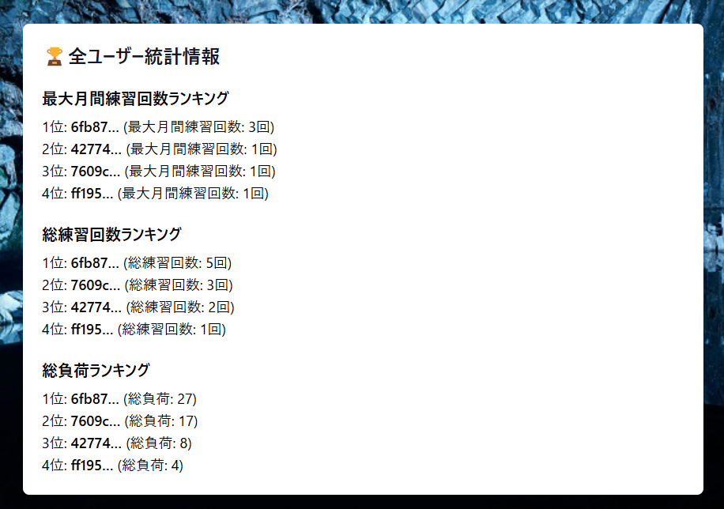
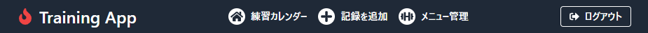
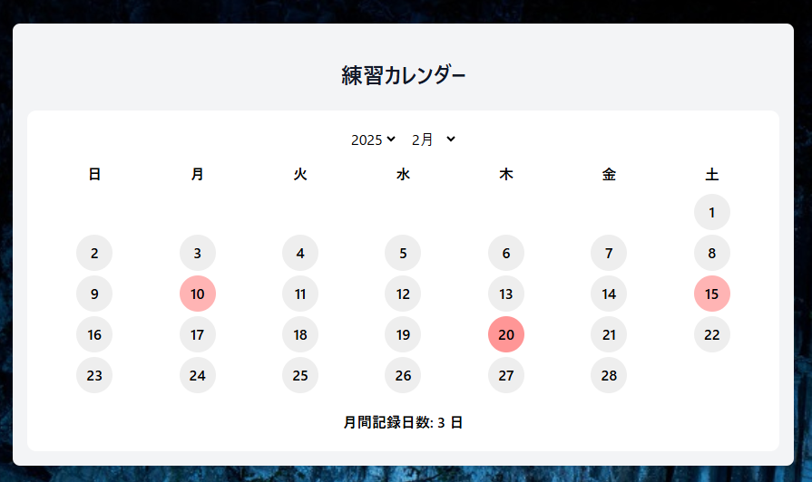
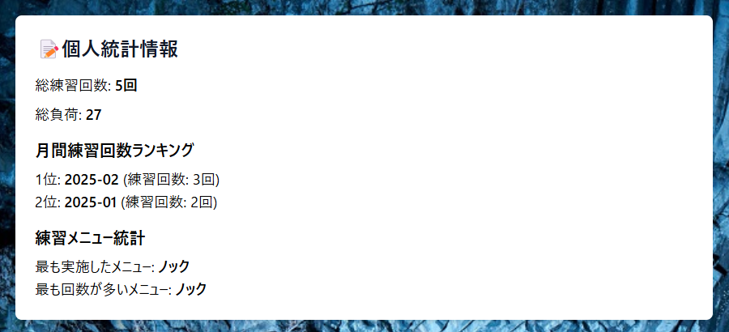
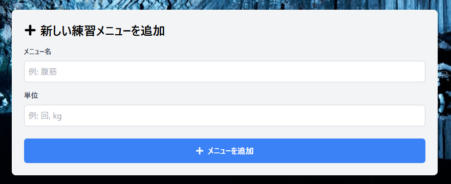
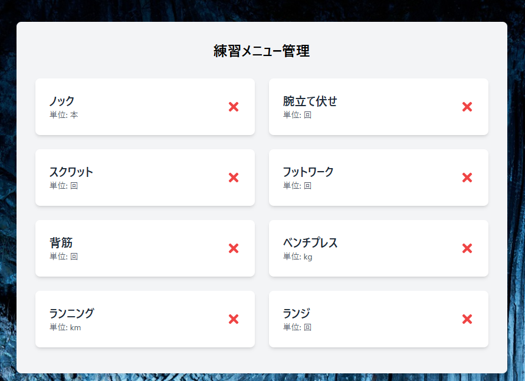
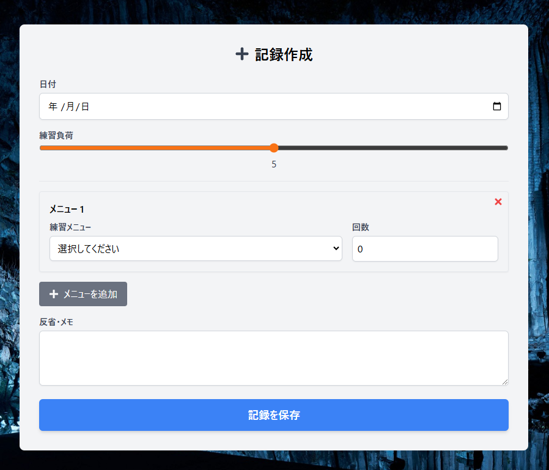
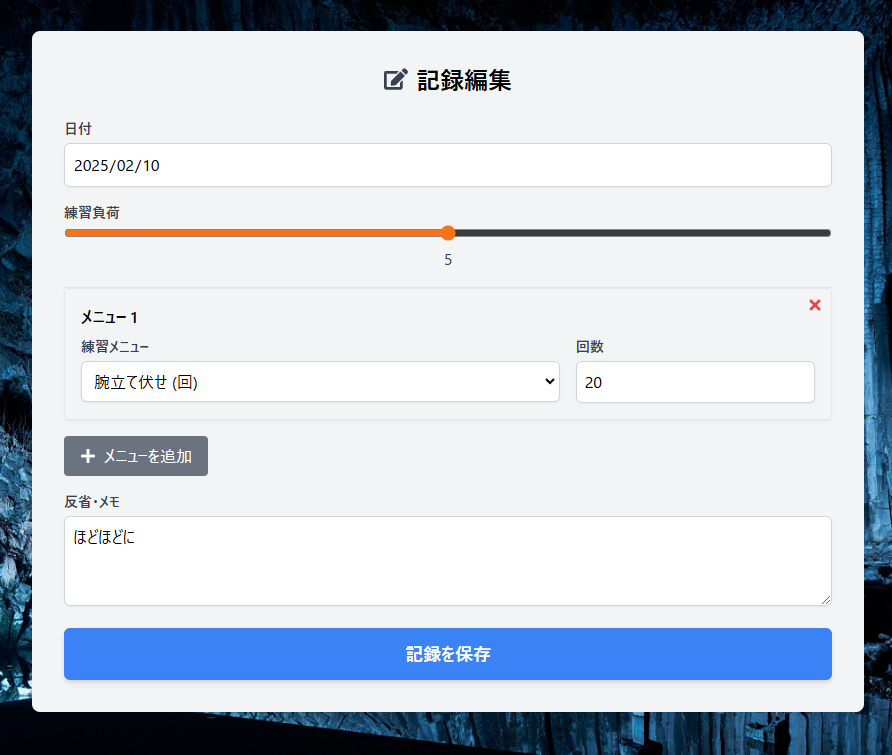

# Training App

 「Training App」は、ユーザーが自身のトレーニング記録を管理し、過去の自分との練習量を比較することで計画的な成長をサポートするためのウェブアプリケーションである。ユーザーは日々の練習記録を登録・編集でき、統計情報を見ることができます。その他に、このアプリの強みである全ユーザーの統計からランキング機能を搭載していて切磋琢磨してトレーニングを楽しむことができる。  
↓🏆ランキング機能

****
## 使い方
1. 「**Sign up**」 と 「**Log in**」をしていただくとすぐ利用できる。  

1. 初めにヘッダーの説明である。
-「**練習カレンダー**」は次項で説明するが、いわゆる「ホーム画面」  
-「**記録を追加**」は、練習記録を新規作成するページ  
-「**メニュー管理**」は各自で好きな練習メニューを作成できるページ  
  

1. ログインすると「**ホーム画面**」が開く。練習を記録した日がカレンダーに赤色で表示される。また、設定した練習負荷の値に応じてカレンダーの色が赤くなる。そして、赤色の円を押すことで登録したデータを編集できる。
  
また下の図のように、個人の統計を見ることができ、
  
このような、全ユーザーの**ランキング機能**も搭載。
  
1. 次に「**メニュー管理**」についてである。  
まず、メニューを作成する画面は以下の通り。
  
そして、追加されたメニューはこのように表示される。
  
1. 最後に「**記録を追加**」についてである。  
練習記録データにはこれらの項目があり、更に練習メニューは無数に増やすことができる。また、練習負荷は自分がどれぐらいの負荷を感じたかを選択する場所になっており、俺によってカレンダーの色が変動する。ここの練習メニューでは4で作成したものを選ぶことができる。
  
1. 次に「**記録編集**」の方法である。  
この操作は「練習カレンダー」の赤い丸を押すことでその日付のデータを編集することができる。  
  

## 今後実装していきたい点
- **ユーザーidのニックネーム表示**  
ユーザーidを公開することはSecurity面での脆弱性となるためニックネーム機能を用いて、セキュリティ面を高めたい。
- **統計機能のさらなる拡充**  
スポーツ別に分けるなどの詳細なカテゴリ別の統計などを行いたい。
- **グループ内での統計機能**  
グループ機能を搭載することで、同じ部活の人に登録してもらって、練習量を比較することができたり、後輩へのアドバイスなどを行いやすくなる。

## 使用技術  
- **Next.js** および **React**  
  ユーザーインターフェースの構築とページ管理に使用
- **Supabase**  
  認証とデータベース（トレーニング記録、練習メニュー）のバックエンドとして利用
- **Tailwind CSS**  
  レスポンシブで洗練されたデザインを実現
- **React Icons**  
  アイコン表示による視認性向上

## 開発履歴

- 2024年1月23日：プロジェクト開始

## ライセンス

MIT License

Copyright (c) 2024 ksk

Permission is hereby granted, free of charge, to any person obtaining a copy
of this software and associated documentation files (the "Software"), to deal
in the Software without restriction, including without limitation the rights
to use, copy, modify, merge, publish, distribute, sublicense, and/or sell
copies of the Software, and to permit persons to whom the Software is
furnished to do so, subject to the following conditions:

The above copyright notice and this permission notice shall be included in all
copies or substantial portions of the Software.

THE SOFTWARE IS PROVIDED "AS IS", WITHOUT WARRANTY OF ANY KIND, EXPRESS OR
IMPLIED, INCLUDING BUT NOT LIMITED TO THE WARRANTIES OF MERCHANTABILITY,
FITNESS FOR A PARTICULAR PURPOSE AND NONINFRINGEMENT. IN NO EVENT SHALL THE
AUTHORS OR COPYRIGHT HOLDERS BE LIABLE FOR ANY CLAIM, DAMAGES OR OTHER
LIABILITY, WHETHER IN AN ACTION OF CONTRACT, TORT OR OTHERWISE, ARISING FROM,
OUT OF OR IN CONNECTION WITH THE SOFTWARE OR THE USE OR OTHER DEALINGS IN THE
SOFTWARE.